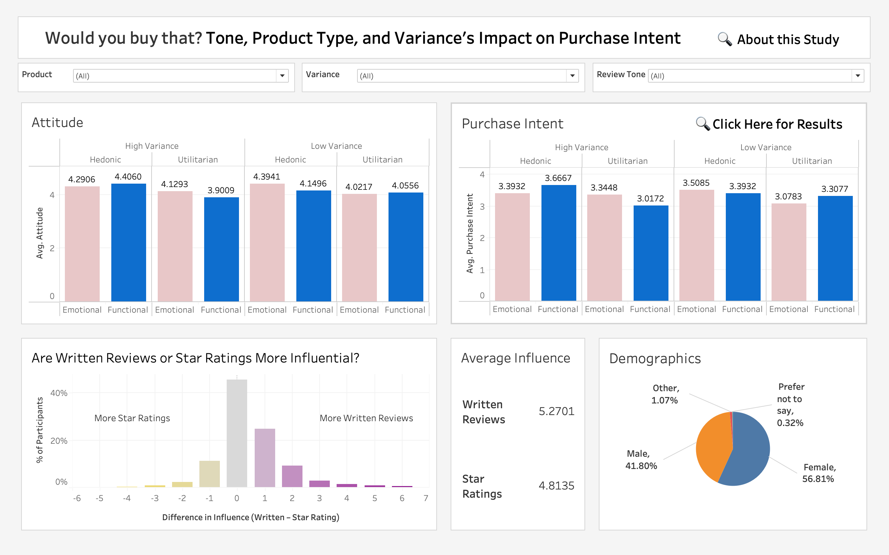

# SURA Review Tone Experiment

This repository contains a research project conducted under the Summer Undergraduate Research Apprenticeship (SURA) at Carnegie Mellon University. The study tests how online review tone, product type, and rating variance affect consumer purchase intent and product attitude.

## Project Background

Consumers use both star ratings and written reviews to evaluate products. Prior studies often look at these elements in isolation. This project evaluates them together in a full-factorial design. It asks: How do tone, product category, and rating variance shape buying decisions?

The study simulates online product pages. Participants see different combinations of review tone, star rating variance, and product type. They rate their attitude and purchase intent. Responses are measured using 7-point Likert scales.

## Study Design

- 2 × 2 × 2 between-subjects experiment
- N = 359
- Factors:
  - **Review Tone**: Emotional vs. Functional
  - **Product Type**: Hedonic (perfume) vs. Utilitarian (USB drive)
  - **Star Rating Variance**: High vs. Low
- Outcomes:
  - Purchase Intent (2-item average)
  - Attitude Toward Product (2-item average)
  - Influence of Star Ratings
  - Influence of Written Reviews

## Hypotheses and Reasoning

### H1

**For utilitarian products under low-variance conditions, functional tone will lower product evaluations compared to emotional tone.**

When star ratings show low variance, consumers trust that most reviews agree. For utilitarian products like a USB, people focus on performance. Functional reviews match this mindset. If they include criticism, that criticism appears more credible and serious.

In contrast, emotional reviews are easier to dismiss. Negative content seems subjective or mood-driven. Emotional framing also evokes a positive feeling, which can raise overall product attitude. This makes emotional tone more persuasive than functional tone under low risk.

### H2

**This tone × product effect will disappear under high variance.**

When star ratings are spread out, consumers become cautious. They seek clear, diagnostic cues. Emotional tone loses power in this context. Functional tone becomes more useful. In these high-variance settings, functional reviews do not hurt utilitarian products the same way they do under low variance.

The emotional advantage disappears because affective cues are harder to trust when risk is high.

## Tools

- **R**: Data cleaning using dummy dataset (see `data-cleaning-r/`)
- **SPSS**: Statistical analysis (ANOVA, t-tests)
- **Tableau**: Dashboard and data visualization
- **Qualtrics**: Survey delivery and randomization

## Key Insights

- **Review tone alone does not affect purchase intent** for utilitarian products under low variance. H1 was not supported.
- **Three-way interaction was significant** for purchase intent *(p = .039)*. It was marginally significant for attitude *(p = .059)*.
- Under **high variance and functional tone**, hedonic products scored higher than utilitarian:
  - Attitude *(p = .003)*
  - Purchase Intent *(p = .007)*
- Under **low variance and emotional tone**, hedonic again outperformed utilitarian:
  - Attitude *(p = .011)*
  - Purchase Intent *(p = .042)*
- **Gender differed significantly across conditions** *(p = .030)*

## Recommendations

Use this research to improve how product reviews are structured and surfaced online.

- **Match tone to product type**. Emotional reviews are better suited for hedonic products. For utilitarian items, functional reviews perform equally well or better when variance is high.
- **Do not assume emotional tone always wins**. It has no advantage under high variance or for practical products.
- **Use functional tone to reduce risk perception**. When rating variance is high, functional language increases trust, especially for utilitarian items.
- **Prioritize written reviews over stars**. Participants relied more on review content than star averages. Highlight well-written reviews near the top of product pages.
- **Test tone-product combinations before launch**. Small changes in tone or presentation can shift intent. This is especially important for new products in categories with diverse consumer expectations.

## Dashboard

View the full interactive Tableau dashboard here:  
🔗 [Insert Tableau Public Link](https://public.tableau.com/your-dashboard-link)

📸 Preview:  

The dashboard includes:
- All 8 experimental conditions
- Attitude and purchase intent breakdowns
- Filters for tone, product, and variance
- Comparison of written review vs. star rating influence
- Demographics breakdown
- Key findings panel

## Author

Omar Khalaf  
Carnegie Mellon University Qatar  
Business Administration

